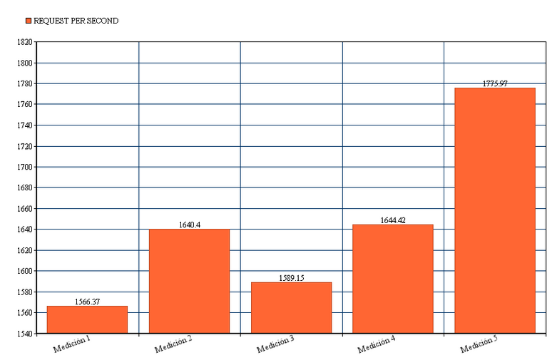

###Práctica 4 SWAP

Para esta práctica, **en primer lugar**, he creado una máquina virtual nueva desde la cual vamos a utilizar como máquina externa a la granja web para
realizar las peticiones web. En ella vamos a seleccionar en la instalación que incluya LAMP para realizar la peticiones con Apache Benchmark.

Creamos, por ejempo, en la máquina 1 una página html sencilla, en mi caso llamada hola.html, y a continuación,
en nuestra máquina 4 recién creada vamos a lanzar peticiones web y comprobar su nivel de rendimiento.

###1- Rendimiento de una sola máquina servidora.

En la siguiente imagen podemos ver como se **lanzan las peticiones** (en este caso se solicita la web 1000 veces con nivel de concurrencia de 5 en 5) sobre la web
alojada en /var/www de la máquina 1, con ip 192.168.1.100.

Redirigimos la salida a un fichero de texto ya que no nos permite visualizar desde la terminal todo el contenido resultante.

Ahora vemos el fichero de salida con los **resultados obtenidos por ab**:

Los parámetros que tenemos que seleccionar para realizar las mediciones son:

**Time taken for tests: 0.721 seconds**

**Failed requests: 0**

**Requests per second: 1386.99 [#/sec] (mean)**

A continuación, muestro una tabla con los resultados de 5 mediciones
sobre los cuales haremos la gráfica. **Para incrementar la dificultad se van a hacer 100000 peticiones
con un nivel de concurrencia de 100.**

Mostramos ahora las **gráficas**, descartando Failed Request, ya que no hemos obtenido ningún fallo.

###2- Rendimiento de la granja web con balanceador de carga

####2.1- Con balanceador nginx.

Vamos a realizar en primer lugar las pruebas de rendimiento
con ab sobre el balanceador de carga en esta ocasión.

Realizamos con el mismo comando anterior las peticiones a la ip del servidor balanceador
nginx, la cual es 192.168.1.102 e igualmente redirigimos la salida a un txt.

Y vemos en Server Software como está haciendo el balanceo correctamente con nginx.

Ahora mostramos la **tabla y gráficas** con el mismo formato anterior para la granja web.

####2.2- Con balanceador haproxy.

Ahora vamos a realizar las mediciones con ab para el balanceador haproxy sobre nuestra granja web.

Igual que anteriormente, realizamos las peticiones sobre el servidor que contiene haproxy, el cual pertenece
a la ip 192.168.102 y redirigimos nuevamente los resultados a ficheros de salida.

Realizamos este paso para las 5 mediciones y muestro la **tabla con los resultados y las gráficas.**

###3- Herramienta SIEGE

####3.1 - Sobre máquina individual.

Por último vamos a trabajar con el benchmark **Siege**.

Lanzamos un test sin pausas, de 60 segundos con valor por defecto de 15 usuarios sobre la máquina 1 con ip 192.168.1.100.
En la siguiente imagen podemos visualizar los resultados.

Los valores que vamos a tener en cuenta para las mediciones son
**Availability, Elapsed time, Response time, Transaction Rate, Failed Transactions y
Longest Transaction
**

####3.2- Sobre la granja web con nginx.

Lanzamos las peticiones igual que el punto anterior pero esta vez sobre la granja con
balanceador nginx.

En la siguiente tabla podemos ver los resultados de todos los parámetros que debemos tener en
cuenta para este apartado.

####3.3- Sobre la granja web con haproxy.

Paramos el servicio de nginx en nuestra máquina balanceadora e iniciamos haproxy. El procedimiento es igual que
  en el punto anterior.

En la siguiente tabla podemos ver los resultados de todos los parámetros que debemos tener en
cuenta para este apartado.

