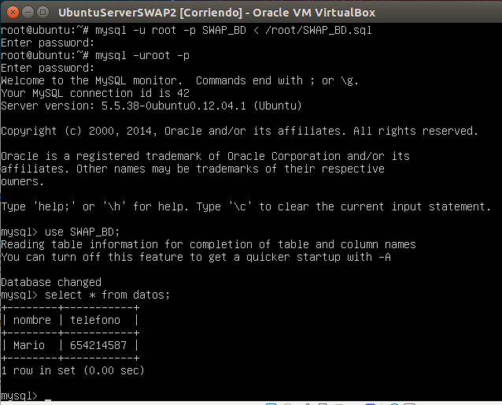

###Práctica 5 SWAP

En esta quinta práctica vamos a **replicar dos bases de datos mediante dos máquinas servidoras, en la cual una va a tener función maestro y otra esclavo.**

El primer objetivo a realizar va a ser **replicar una tabla de una máquina a otra con mysqldump**.

En primer lugar, arrancamos las máquinas objetivo, accedemos a mysql y creamos una tabla en la máquina 1.

En las siguientes capturas podemos ver como creamos la base de datos, creamos una tabla en la cual insertamos datos, y tras esto realizamos una consulta para ver los datos que tenemos insertados en la tabla y asi comprobamos que se han insertado correctamente.

A continuación vamos a replicar la base de datos, y primero vamos a crear otra base de datos vacía con el mismo nombre en la máquina 2, la cual va a ser donde vamo a tener alojada nuestra copia de seguridad de la base de datos.

Ahora la bloquearemos para que en este paso no se pueden insertar más datos hasta que esté completa la replicación.

Y a continuación, con la herramienta mysqldump, replicamos la base de datos. En esta captura vemos como exportamos la base de datos ya creada en local y la redirigimos al directorio /root.

Quitamos el bloqueo de las tablas en mysql.

Y ahora, desde la máquina 2, vamos a hacer activa la réplica de la base de datos guardada anteriormente a través del comando scp.

Y actualizamos la base de datos mysql creada anteriormente, realizando una consulta sobre la tabla para comprobar que los datos han sido actualizados correctamente.

