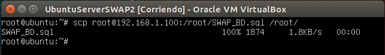

###Práctica 5 SWAP

En esta quinta práctica vamos a **replicar dos bases de datos mediante dos máquinas servidoras, en la cual una va a tener función maestro y otra esclavo.**

El **primer objetivo** a realizar va a ser **replicar una tabla de una máquina a otra con mysqldump**.

En primer lugar, arrancamos las máquinas objetivo, accedemos a mysql y creamos una tabla en la máquina 1.

En las siguientes capturas podemos ver como creamos la base de datos, creamos una tabla en la cual insertamos datos, y tras esto realizamos una consulta para ver los datos que tenemos insertados en la tabla y asi comprobamos que se han insertado correctamente.

A continuación vamos a replicar la base de datos, y primero vamos a crear otra base de datos vacía con el mismo nombre en la máquina 2, la cual va a ser donde vamo a tener alojada nuestra copia de seguridad de la base de datos.

Ahora la bloquearemos para que en este paso no se pueden insertar más datos hasta que esté completa la replicación.

Y a continuación, con la herramienta mysqldump, replicamos la base de datos. En esta captura vemos como exportamos la base de datos ya creada en local y la redirigimos al directorio /root.

Quitamos el bloqueo de las tablas en mysql.

Y ahora, desde la máquina 2, vamos a hacer activa la réplica de la base de datos guardada anteriormente a través del comando scp.

Y actualizamos la base de datos mysql creada anteriormente, realizando una consulta sobre la tabla para comprobar que los datos han sido actualizados y la máquina clonada ha replicado la tabla correctamente.

El **segundo objetivo** va a ser **configurar las máquinas como maestro-esclavo para que la replicación se realice automaticamente**, y así no sea necesario ejecutar los pasos anteriores.

En primer lugar, en el maestro, editamos el fichero my.cnf y lo configuramos modificando las lineas pertenecientes a bind-address, log_error, server-id y log_bin como vemos en las imágenes.

Reiniciamos el servicio mysql y vemos que no ha lanzado ningún error, por lo tanto la configuración es correcta y procedemos a configurar el fichero del esclavo, donde va a ser igual que para el maestro con la diferencia de que server_id va a ser 2.

Reiniciamos el servicio y ahora accedemos nuevamente al maestro.

Accedemos a mysql y vamos a crear un usuario y ejecutar las siguientes ordenes.

Y obtenemos los datos de la base de datos que vamos a replicar.

Ahora de nuevo vamos a la máquina esclavo donde ejecutamos la siguiente orden para configurar el esclavo, definiendo cual va a ser la máquina maestro y lo arrancamos.

Volvemos al maestro, desbloqueamos como en el punto anterior las tablas y ya podemos comprobar si todo funciona correctamente. Desde el esclavo ejecutamos la orden SHOW SLAVE STATUS\G y vemos si Seconds_Behind_Master es distinto de null. Como podemos ver en la imagen, es 0, por tanto todo está funcionando correctamente.

Por último, vamos a comprobar que todo funciona correctamente.

En el maestro, insertamos datos nuevos en la base de datos creada:

Y desde la máquina esclavo, vemos que la replicación se ha realizado correctamente.

