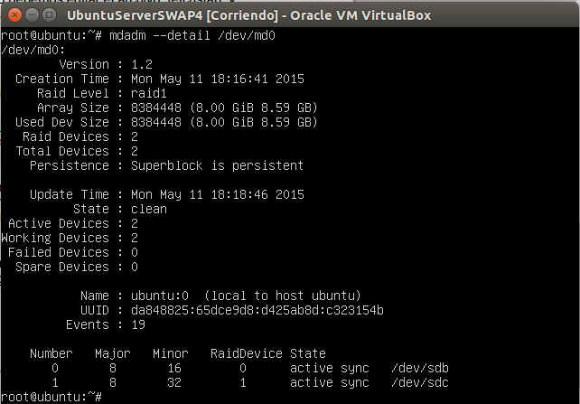

###Práctica 6 SWAP

En esta práctica vamos a **configurar un RAID1 con dos discos virtuales**, usando una de nuestras máquinas virtuales creadas en las prácticas anteriores.

En primer lugar, si utilizamos VirtualBox, creamos dos discos nuevos con nuestra máquina apagada. En la siguiente imagen podemos ver como están creados.

A continuación, instalamos la herramienta **mdadm** mediante el comando

<pre>sudo apt-get install mdadm</pre>

y listamos los discos mediante el comando:

<pre> fdisk -l</pre>

Vemos en la siguiente imagen como están creados los discos nuevos, ambos aún sin formato, llamados sdb y sdc.

A continuación, usando la herramienta mdadm podemos crear los discos RAID1 usando el dispositivo md0. Vemos como se crea correctamente:

Y ahora damos formato al dispositivo md0.

Creamos el directorio que se montará en nuestra unidad RAID1:

Y comprobamos el estado de nuestro RAID:

Por último, para que en el arranque de nuestro sistema monte automáticamente nuestro RAID, tenemos que editar el fichero /etc/fstab.

A partir de la herramienta blkid podemos ver el UUID del disco a montar automáticamente, en nuestro caso md0. Vemos la siguiente salida.

Finalmente, añadiendo el UUID de md0 a nuestro fichero /etc/fstab se montará automáticamente el RAID1 al iniciar el sistema.
