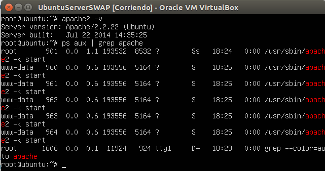
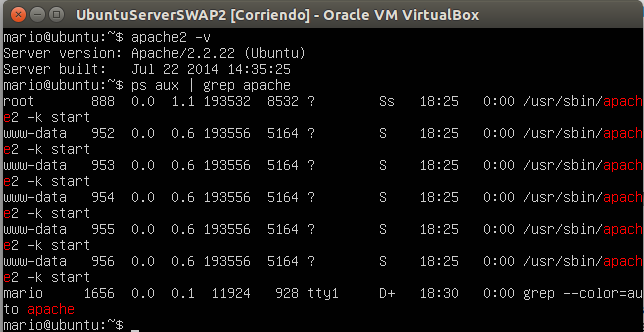

###Practica 1 SWAP

En las siguientes capturas de pantalla podemos ver la ejecución de los siguientes comandos para ambas máquinas virtuales.

<pre>
apache2 -v
ps aux | grep apache
</pre>

**Máquina virtual 1 - Ubuntu Server 12.04**

**Máquina virtual 2 - Ubuntu Server 12.04**

