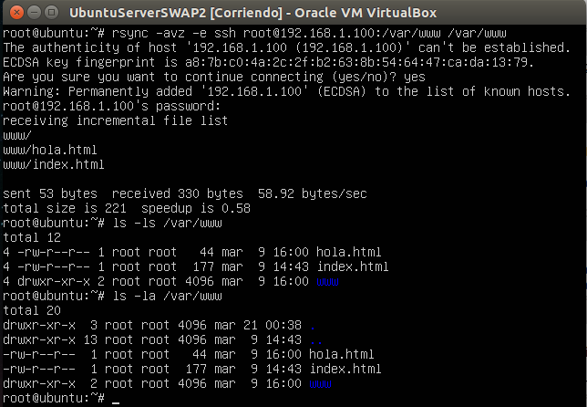
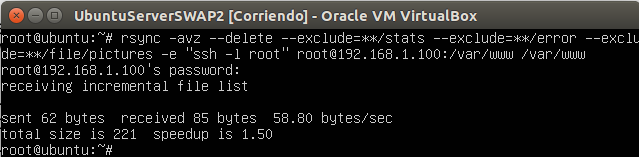
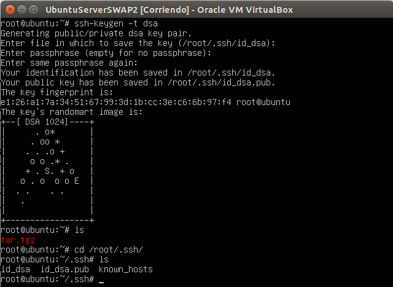
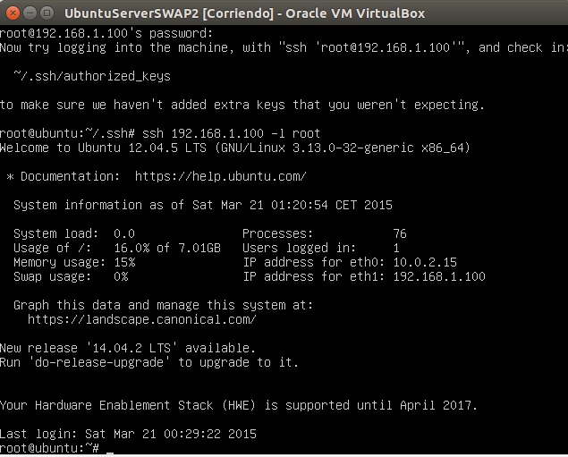
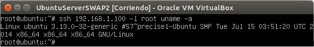
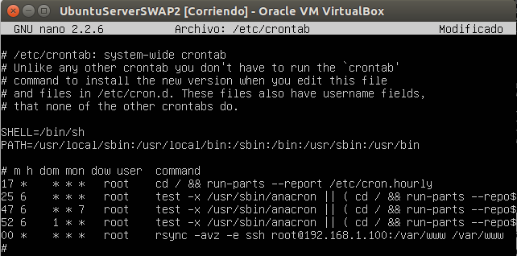

###Práctica 2 SWAP

En primer lugar,en el **apartado 2**, vamos a ver la forma de **comprimir una carpeta** en tar.tgz y enviarla por **ssh** a otra máquina.

Para ello en primer lugar he ejecutado en una máquina virtual la siguiente instrucción, haciendo referencia a la IP de la máquina virtual destino.

Y comprobamos en la siguiente captura como se ha enviado correctamente.

Ahora realizamos el **apartado 3**, donde utilizamos la herramienta **rsync**. En primer lugar, una vez comprobado que el paquete rsync viene instalado en nuestra máquina por defecto, comprobamos su funcionamiento ejecutando la siguiente instrucción y vemos el correcto funcionamiento y que el directorio está correctamente clonado.

Por último, para éste apartado en el que tratamos la herramienta rsync, vamos a realizar las **reestricciones** que se especifican en el guión de prácticas.

Vamos ahora con el **apartado 4**, donde vamos a especificar como **conectar por ssh sin contraseña**, ya que para la ejecución de ciertos scripts que tengan que conectarse por ssh a otra máquina, quedan bloqueados ya que es necesario introducir una contraseña para la conexión remota.

En primer lugar, sobre la máquina secundaria ejecutamos la siguiente orden.

Y podemos comprobar en la imagen que nos ha generado correctamente los ficheros.

A continuación, copiando la clave publica al servidor principal, mediante ssh-copy-id -i .ssh/id_dsa.pub root@192.168.1.100, vemos en la siguiente imagen como podemos hacer ssh sin pedirnos contraseña.

Ahora probamos a ejecutar un comando por ssh. Podemos ver el correcto funcionamiento en la siguiente imagen.

Por último, en el **apartado 5**, vamos a utilizar la herramienta **crontab**.

Vamos a programar una tarea editando el fichero /etc/crontab, la cual va a realizar una actualización del fichero /var/www cada hora, actualizando el fichero de la máquina 2 con los datos del que contiene la máquina 1.
Podemos ver la programación de la tarea en la siguiente imagen.

