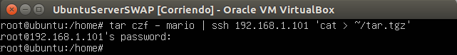
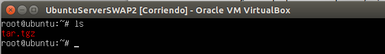

###Práctica 2 SWAP

En primer lugar vamos a ver la forma de comprimir una carpeta en tar.tgz y enviarla por ssh a otra máquina.

Pra ello en primer lugar he ejecutado en una máquina virtual la siguiente instrucción, haciendo referencia a la IP de la máquina virtual destino.

Y comprobamos en la siguiente captura como se ha enviado correctamente.

