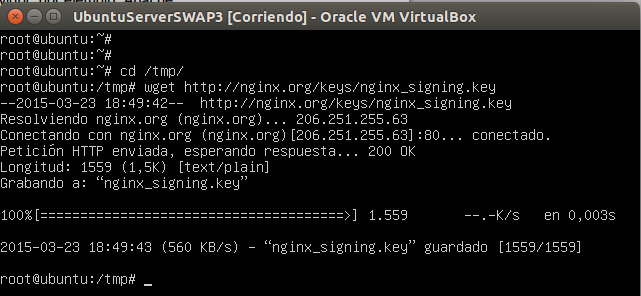
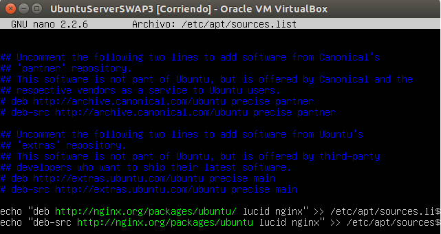
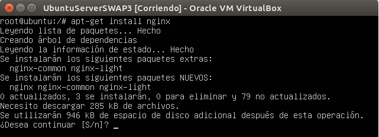
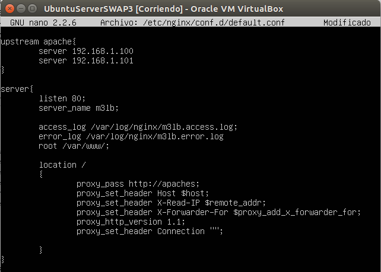

###Práctica 3 SWAP

En primer lugar, vamos a **instalar nginx** en nuestra tercera máquina Ubuntu Server.
Para ello, vamos primero a importar la clave del repositorio de la siguietne forma:

Y a continuación, editamos el fichero sources.list para agregar los paquetes al repositorio.

Para terminar con la instalación del servidor web nginx, ejecutamos el siguiente comando y tras aceptar la instalación, ya tendremos nginx en nuestro servidor.

Una vez finalizada la instalación, lo **configuramos como balanceador de carga** de la siguiente manera:

Creamos el fichero default.conf en la ruta /etc/nginx/conf.d/ y definimos, como vemos en la imagen, las máquinas que van a formar parte del clúster web, en este caso las máquinas virtuales servidoras creadas en prácticas anteriores.

En este fichero especificamos las ip's de dichas máquinas.

A continuación, a este mismo fichero, y posterior a la sección server, le indicamos, como muestro en al siguiente imagen, la configuración para indicarle que use el grupo definido anteriormente (upstream).

Reiniciamos el servicio nginx para que tome la nueva configuración:

<pre>service nginx restart</pre>

Y comprobamos que funciona correctamente realizando peticiones web mediante curl http://192.168.1.102, es decir, al servidor que está ejecutando nginx.

Para finalizar con la configuración de nginx vamos a añadir a la configuración el doble de peso a la maquina servidora 1 mediante la directiva weight.

Comprobamos que sigue funcionando correctamente con ambas maquinas servidoras (1 y 2).

Vamos ahora a realizar la segunda parte de la práctica, en la cual se va a realizar la instalación y configuración de balanceo de carga con **haproxy**.

En primer lugar instalamos este software de balanceo mediante el siguiente comando:

<pre>apt-get install haproxy</pre>

Y vamos a editar su fichero de configuración como podemos ver en la siguiente imagen:

Tras esto, paramos el servicio nginx:

<pre>service nginx stop</pre>

Y lanzamos el servicio haproxy:

Una vez llegados a este punto, con nuestros servidores debemos poder realizar peticiones web al servidor que contiene el haproxy, es decir, nuestra máquina 3, con ip 192.168.1.102.

Vemos en las siguientes imágenes como las peticiones se realizan correctamente con ambas máquinas.

